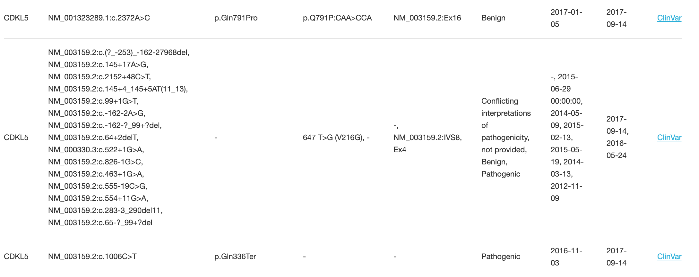

# Variant Search Coding Assignment

## Assignment

Create a web application that allows a user to search for genomic variants by gene name and display the results in a tabular view.

## Install

Install dependencies:

Python3, with packages pandas, numpy, dash, visdcc


## Datasource

A zipped TSV file of variants is available in /data/variants.tsv.zip. Each row in the TSV file represents a genomic variant and contains a Gene column with the gene name. A variant will belong to one and only one gene, but multiple variants may belong to the same gene.

## Usage

1. Download or clone the repository:
```
git git@github.com:dingdingziyun/variant-search-coding-assignment.git
cd variant-search-coding-assignment
```
2. Unzip data
```
unzip ./data/variants.tsv.zip
```
3. Start server
```
python app.py
```
4. Copy and paste the address to web browser


Here’s an example of how the web app looks like when you typing the gene name:


Here’s an example output of gene "CDKL5":


Here's an example output that the table groups the same protein changes together


## Submitting Your Solution

Please clone this repository and upload an archive to Greenhouse, or upload your repository to GitHub and send us a link. Update this README to include instructions on how to install, test, and run your application. Bonus: Deploy it and include the URL here.

As part of the review process, we may comment on or ask questions about specific parts of the code.

Please return your solution within 1 week. This is not an expectation of the time required to complete the assignment. Rather, it’s meant to provide buffer for busy schedules.

## Questions

Please ask if any part of the assignment is unclear. Communicate with us as you would with your project team at work.
