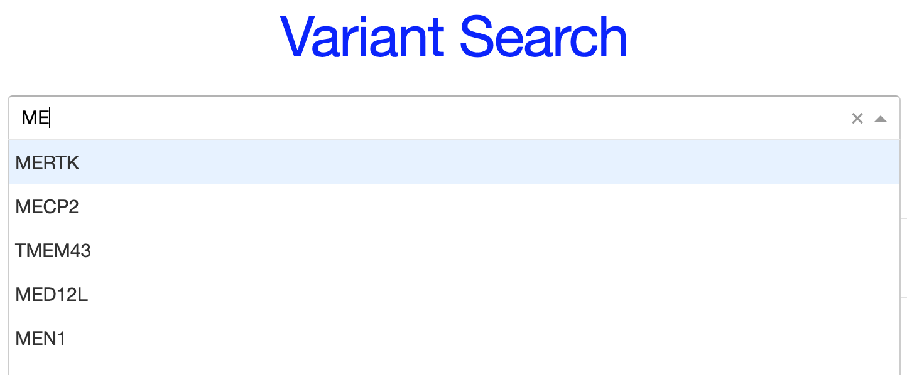
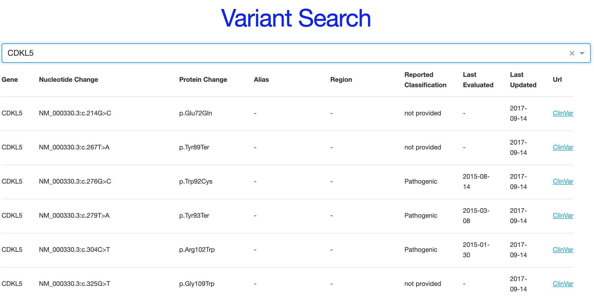

# Variant Search Coding Assignment

## Assignment

Create a web application that allows a user to search for genomic variants by gene name and display the results in a tabular view.

## Deployed Web Server: http://ziyun-ding-variant-calling.herokuapp.com/

## Install

Install dependencies:

Python3, with packages pandas, numpy, dash, visdcc


## Datasource

A zipped TSV file of variants is available in /data/variants.tsv.zip. Each row in the TSV file represents a genomic variant and contains a Gene column with the gene name. A variant will belong to one and only one gene, but multiple variants may belong to the same gene.

## Usage

1. Download or clone the repository:
```
git git@github.com:dingdingziyun/variant-search-coding-assignment.git
cd variant-search-coding-assignment
```
2. Unzip data
```
unzip ./data/variants.tsv.zip
```
3. Run server at backend
```
python app.py
```
4. Copy and paste the address to web browser

## Example outputs

Here’s an example of how the web app looks like when you typing the gene name:


Here’s an example output of gene "CDKL5":


Here's an example output that the table groups the same protein changes and Reported Classification together


## Future improvements
1. Make interactive table, so user can sort table by click on the header. This function can be realized with "DataTable" in Dash. However, Datatable cannot adapt a column with hyperlinks. But this function can be realized refering to "https://stackoverflow.com/questions/32778648/how-to-display-a-hyperlink-in-a-cell-with-jquery-datatables"
2. The data can be queried with PostgreSQL.
3. Add a dropdown menu, so that the user can customize the columns to group the entries.
